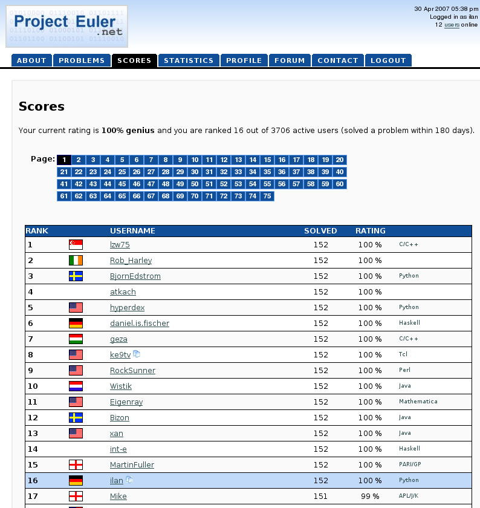

# Project Euler

Collection of my Project Euler programs.
These should all work with Python 3.8 or above.
Some may require additional packages, in
particular `sympy`.

Back in April 2007, I had all 152 current problems solved!
Back then there was no way to search the answers like there is now.
I took a screenshot to prove it:

